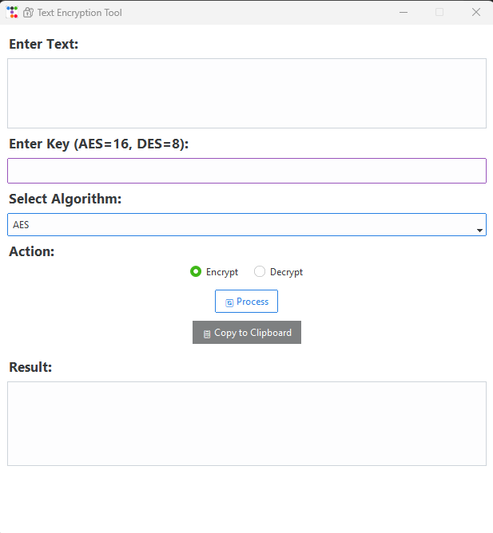
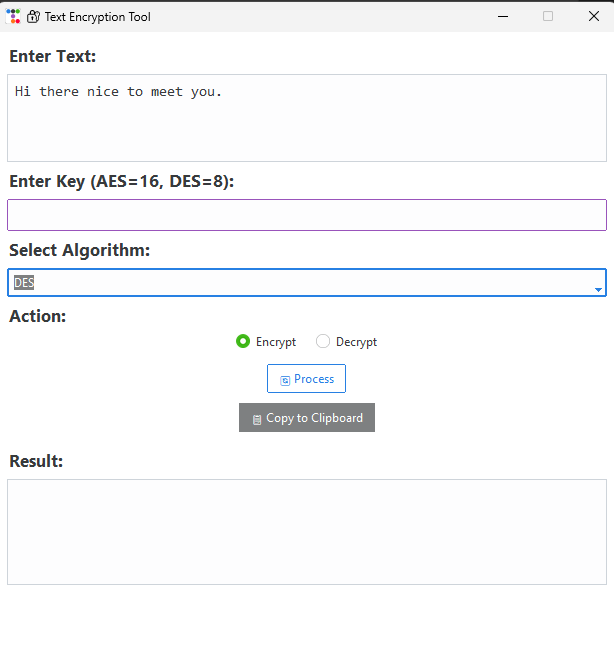
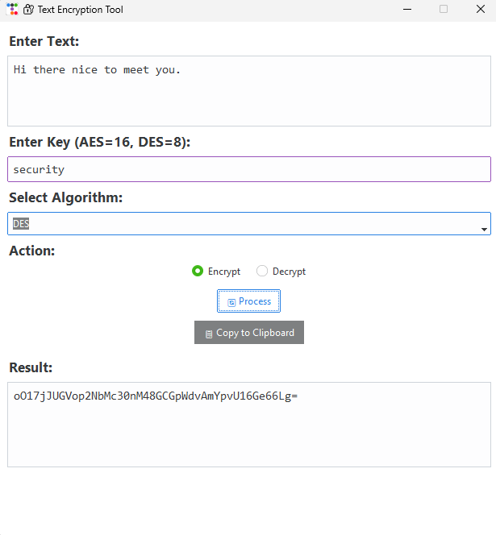

# 🔐 Text Encryption Tool

A powerful, beginner-friendly cybersecurity application built in **Python** for encrypting and decrypting text using modern algorithms like **AES**, **DES**, and **RSA**.

This tool includes a sleek GUI built with `ttkbootstrap`, designed to run seamlessly on **Windows** and **Kali Linux**, featuring a minimalist, rounded, and dynamic theme.

---

## 🧠 Features

- 🔐 Encrypt & decrypt text using:
  - **AES (Advanced Encryption Standard)**
  - **DES (Data Encryption Standard)**
  - **RSA (Rivest–Shamir–Adleman)**
- 🖥️ Modern and minimal **GUI** with theme support
- 🧠 Smart key detection (RSA disables key entry)
- 📋 Copy encrypted/decrypted output to clipboard
- ⚙️ Built with **Python 3.13.5**
- 🪟 Converts easily into `.exe` (ready for production use)
- 💼 Internship-ready cybersecurity project

---

## 🔒 Algorithms Used

| Algorithm | Type         | Key Required? | Key Size             |
|-----------|--------------|----------------|----------------------|
| AES       | Symmetric    | ✅ Yes          | 16 characters        |
| DES       | Symmetric    | ✅ Yes          | 8 characters         |
| RSA       | Asymmetric   | ❌ No (Auto)    | Public/Private Pair  |

---

## 🚀 How It Works

1. Enter plain text into the input field.
2. Select an encryption algorithm.
3. Enter the encryption key if required (AES/DES).
4. Click **Encrypt** or **Decrypt**.
5. Copy the result with one click.

---

## 🖼️ GUI Screenshots

> *(Make sure you’ve uploaded `a.png`, `b.png`, and `c.png` to your repo)*





---

## ⚙️ Installation

### 1️⃣ Clone the Repository
```bash
git clone https://github.com/ankitkar205/Text-Encryption-Tool-.git
cd Text-Encryption-Tool-
2️⃣ Create & Activate a Virtual Environment
bash
Copy
Edit
python -m venv .venv

# On Windows
.venv\Scripts\activate

# On Linux/Mac
source .venv/bin/activate
3️⃣ Install Dependencies
bash
Copy
Edit
pip install -r requirements.txt
4️⃣ Run the App
bash
Copy
Edit
python gui.py
📦 Build Executable (.exe)
💡 Install PyInstaller
bash
Copy
Edit
pip install pyinstaller
🔨 Build the .exe
bash
Copy
Edit
pyinstaller gui.py --onefile --noconsole --icon=icon.ico
Final .exe will appear in the dist/ folder.

You can skip the --icon=icon.ico part if you don’t use a custom icon.

📁 Project Structure
bash
Copy
Edit
Text-Encryption-Tool-/
├── gui.py               # Main GUI app
├── aes_module.py        # AES logic
├── des_module.py        # DES logic
├── rsa_module.py        # RSA logic
├── main.py              # Optional CLI version
├── icon.ico             # Optional app icon
├── README.md            # This file
├── requirements.txt     # Required libraries
└── dist/                # Executable output folder
✅ Requirements
Python 3.13.5 or higher

Required Libraries:
txt
Copy
Edit
ttkbootstrap
pycryptodome
rsa
📃 License
MIT License © 2025 [Ankit]

🤝 Credits
Developed by Ankit
Cyber Security Internship – Pinnacle Labs
Made with ❤️ using Python, coffee ☕, and clean code.

